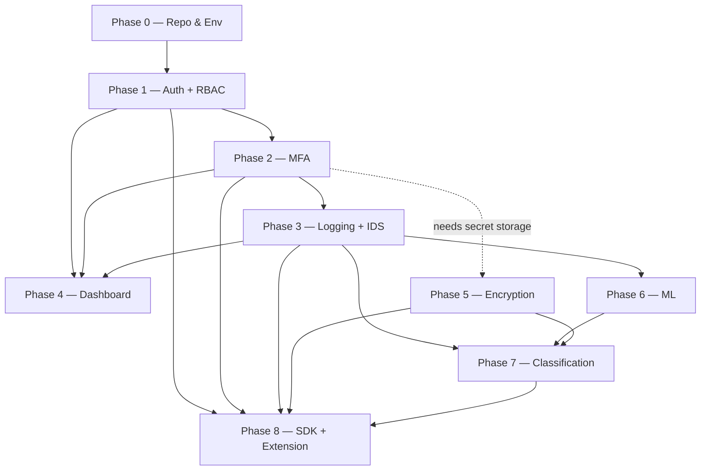

# SentinelKey — Project Context & Roadmap Analysis

> Generated analysis of `docs/SECURITY-STACK-PHASES.md` for the coding agent.
> This file is the distilled map; the roadmap remains the source of truth for per-phase acceptance criteria.

## 1. What this is

SentinelKey is a **self-hosted security stack** that bundles authentication, encryption, intrusion detection, and compliance/classification into one product. The defining constraint is **sovereignty of security logic**: every security-critical algorithm is hand-built in this repo — no third-party auth/security SaaS. External APIs are allowed only for *peripheral delivery* (email/SMS sending, optional KMS, charting).

## 2. Stack & tooling

| Concern | Choice |
|---|---|
| Frontend | React (Vite) — `apps/dashboard` |
| Backend | Node.js + Express + MongoDB — `apps/api` |
| ML microservice | Python (Flask/FastAPI) — `apps/ml-service` |
| Internal SDK | Node.js package — `packages/security-stack-sdk` |
| Shared types | TypeScript package — `packages/shared-types` |
| Browser extension | Manifest V3 — `extension/` (Phase 8, stub only) |
| Package manager | **pnpm only** (workspaces, `workspace:*` protocol) |
| Language decision | **TypeScript** for `api` + `dashboard` (recommended and chosen — stronger contracts for a security product) |

## 3. Phase map

| Phase | Title | Key deliverable | Blocks |
|---|---|---|---|
| 0 | Repo & Environment Setup | Runnable pnpm monorepo + Docker Compose + `/health` | — |
| 1 | Auth + RBAC | Custom JWT (access+refresh), bcrypt/argon2, RBAC engine | 2,3,4,8 |
| 2 | MFA | TOTP/HOTP or OTP, attempt limiting + lockout | 3,4,8 |
| 3 | Logging + Rules-based IDS | `SecurityEvent` schema, heuristics engine, alerts | 4,6,7 |
| 4 | Dashboard (React) | RBAC-aware UI over Phases 1–3 | — |
| 5 | Encryption | AES-256-GCM field/file encryption, key rotation + versioning | 7,8 (placeholder needed by 2) |
| 6 | ML Anomaly Detection | Python training + `/score` inference, fallback to heuristics | — |
| 7 | Compliance / Classification | Event/File/Email classifiers on a shared rules engine | 8 |
| 8 | SDK + Browser Extension | Typed SDK wrapper, MV3 extension that fails safe | — |

## 4. Dependency graph

**Notes on non-linear edges:**
- Phase 4 (Dashboard) is scheduled **early on purpose** — it makes Phases 1–3 demoable before the hard work in 5–7.
- Phase 2 (MFA) stores secrets encrypted; a temporary AES placeholder is acceptable until Phase 5 lands, then it must be reconciled.
- Phase 6 (ML) **requires** accumulated `SecurityEvent` data from Phase 3 (real or synthetic-seeded). Phase 3's synthetic heuristic tests double as bootstrap training data.
- Phase 7 (classification) is **fully deterministic** — explicitly no LLM. The only LLM exception is decided *in Phase 7, not silently*.

## 5. Core vs Peripheral (hand-built vs external)

**Hardcoded (must build in-repo):** JWT/session/RBAC, MFA generation+verification, encryption/decryption + rotation, all detection heuristics + scoring, ML training/features/model, classification rules engine + taxonomy, alert trigger + dedup/throttle, dashboard aggregation logic.

**External allowed (peripheral only):** SMS/email *delivery*, optional cloud KMS for master-key storage, charting *libraries* (not APIs), Slack/email/SMS delivery channels for alerts.

## 6. Cross-cutting rules (applies to every phase)

1. Never substitute an external API for anything "must be hardcoded" — stop and flag instead of silently swapping.
2. Each phase's Definition of Done must be met before the next phase starts.
3. Every security-relevant action emits a `SecurityEvent` (Phase 3 schema) — retrofit emitters into Phases 1–2 when Phase 3 lands.
4. No secrets, keys, or `.env` files committed — ever.
5. pnpm only; `workspace:*` for internal package refs.
6. Tests are written *alongside* each phase, not after (auth, encryption, RBAC especially).

## 7. Decisions deferred to their phase (do not decide now)

- **Phase 2:** TOTP vs HOTP vs OTP-over-email/SMS; lockout threshold.
- **Phase 5:** master-key location (env-injected / self-hosted key file / external KMS); rotation cadence and re-encrypt-vs-version-tag policy — must be written to `apps/api/docs/encryption-design.md` *before* code.
- **Phase 6:** exact model (start with isolation forest / z-score-IQR before anything deep-learning-flavored).
- **Phase 7:** whether an LLM API is used for classification — explicit, documented exception only.

## 8. Key risks & notes

- **Phase 6 data dependency** is the longest lead item: Phase 3 must run long enough to accumulate a meaningful event volume.
- **Phase 5 decision gate** must precede implementation — skipping the design doc is called out as a failure mode.
- **Phase 8b fail-safe** must be explicit and tested (extension must not silently allow through when backend is unreachable).
- **Monorepo + Docker** requires each service to be independently buildable (self-contained Dockerfiles; no cross-package `workspace:*` imports until packages actually exist).

## 9. Current status

See [`progress.md`](../progress.md) for the phase-by-phase change log and current position.
