# SentinelKey — System Flow Checkup & Component Optimization Plan

**Document Version:** 1.0.0  
**Date:** September 2026  
**Scope:** Full end-to-end checkup across `apps/api`, `apps/website`, `apps/dashboard`, `packages/shared-types`, and `packages/security-stack-sdk`.  
**Methodology:** Strict adherence to `/engineering` principles (investigate before changing, trace state end-to-end, test proportionally, report verification honestly).

---

## 1. Executive Summary & Verification Evidence

An automated checkup was conducted across the entire monorepo to verify compiler correctness, contract adherence, and regression test suites.

| Verification Target | Command Executed | Result Status | Evidence & Details |
| :--- | :--- | :--- | :--- |
| **Workspace Typecheck** | `pnpm typecheck` | **Verified** | **0 errors** across all 6 workspace packages (`apps/api`, `apps/website`, `apps/dashboard`, `packages/shared-types`, `packages/security-stack-sdk`, `apps/sdk-example`). |
| **API Test Suite** | `pnpm --filter @sentinelkey/api test` | **Verified** | **28 test files passed**, **207 / 207 tests passed** (including Phase 10 unit rollups, quota enforcement, and usage invoicing). |
| **SDK Acceptance Test** | `pnpm --filter @sentinelkey/sdk-example test` | **Verified** | **1/1 passed** — complete fail-safe client round-trip with field encryption and threat classification. |
| **Live Payment Gateway** | Khalti ePayment v2 live network test | **Blocked** | Live ePayment verification requires active Nepal merchant credentials / live user interaction; verified via `MockPaymentProvider` in automated integration tests. |
| **UI State & Component Lifecycles** | Code audit of Hub & SOC components | **Reasoned** | Traced state lifecycle and identified data discrepancies between API responses and frontend components. |

---

## 2. End-to-End Flow Checkup: Architecture & Data Paths

```mermaid
flowchart TD
    subgraph Auth [1. Auth & Session Restoration]
        A1[User Logs In] --> A2[Access Token + Refresh Token Issued]
        A2 --> A3[Stored in Web Storage]
        A3 --> A4[Page Reload F5]
        A4 --> A5{Token Synchronous?}
        A5 -- Website Hub --> A6[Proactive Single-Flight Refresh]
        A5 -- SOC Dashboard --> A7[401 Cascade Interception]
    end

    subgraph Domains [2. Domain Registry & Site Keys]
        D1[Register Localhost Domain] --> D2[API POST /domains]
        D2 --> D3[Generate sk_live_... & Store SHA-256 Hash]
        D3 --> D4[API Returns domain + siteKey]
        D4 --> D5{UI Consumes Response}
        D5 -- Current Bug --> D6[Nested Shape Mismatch: Key Lost]
        D5 -- Target --> D7[One-Time Key Reveal Modal]
    end

    subgraph Metering [3. Site-Key Metering & Invoicing]
        M1[Client Request with Site Key] --> M2[Authenticate Site Key & Check Origin]
        M2 --> M3[Apply Tier: Light 1 / Std 3 / Heavy 10]
        M3 --> M4[Atomic Daily Rollup Inc]
        M4 --> M5[Period Close: max 0, units-incl * rate]
        M5 --> M6{Overage >= 1,000 Paisa?}
        M6 -- Yes --> M7[Generate Usage Invoice with 7d Grace]
        M6 -- No --> M8[Roll Forward to Next Cycle]
    end

    subgraph Billing [4. Payment & Reactivation]
        B1[Usage / Sub Invoice Checkout] --> B2[Khalti Hosted / Mock Wallet]
        B2 --> B3[Return URL with pidx]
        B3 --> B4[Server Lookup & Amount Integrity Check]
        B4 --> B5[Idempotent Fulfillment: Reactivate Domain]
    end
```



---

### Flow 1: Authentication & Session Lifecycle

- **Architecture:**
  - `POST /auth/login` issues a 15-minute access token and a 7-day refresh token.
  - Refresh tokens are tracked in MongoDB with rotation and token-reuse detection (reusing an invalidated refresh token revokes all user sessions).
  - Single-flight refresh logic (`refreshInFlight`) prevents parallel requests from firing duplicate refresh calls.
- **Trace & Verification:**
  - **`apps/website`:** Uses proactive single-flight refresh during boot (`initAuth`) before requesting `GET /auth/me`. Caches user profile and access token in web storage. Reloads (`F5`) complete smoothly.
  - **`apps/dashboard`:** In [`apps/dashboard/src/context/AuthContext.tsx`](file:///d:/Projects/SentinelKey/apps/dashboard/src/context/AuthContext.tsx#L32-L46), `accessToken` starts as `null`. On reload, `api.getMe()` is called without an `Authorization` header, deliberately provoking an HTTP 401 to trigger the refresh interceptor.
  - **Impact:** An unnecessary network roundtrip and console error log on every page refresh in the SOC Dashboard.

---

### Flow 2: Localhost Domain Registration & Site-Key Cryptography (Phase 10a & 10b)

- **Architecture:**
  - `POST /domains` enforces plan limits (Free: 1, Pro: 5, Enterprise: 25+).
  - Validates origin format: allowed hosts (`localhost`, `127.0.0.1`, `[::1]`) and reserved ports (`4000`, `5001`, `5173`, `5174`).
  - Cryptographically generates `sk_live_<hex64>`. Only the SHA-256 hash is saved to MongoDB; the plain key is returned **exactly once** in `{ domain, siteKey }`.
- **Trace & Critical Flow Discrepancy:**
  - In [`apps/website/src/components/hub/ClientDomainManager.tsx`](file:///d:/Projects/SentinelKey/apps/website/src/components/hub/ClientDomainManager.tsx#L83-L95):
    ```ts
    const newDomain = await api.registerDomain({ name, domainUrl, environment });
    setDomains((prev) => [newDomain, ...prev]);
    ```
  - **Root Cause:**
    1. The API returns `{ domain: IDomain, siteKey: string }`, but `registerDomain` in [`apps/website/src/services/api.ts`](file:///d:/Projects/SentinelKey/apps/website/src/services/api.ts#L218-L224) was typed to return `IClientDomain`.
    2. The state receives `{ domain: {...}, siteKey: "..." }` instead of the domain object directly, causing property access bugs on `domain._id` and `domain.name`.
    3. **The plain `siteKey` is never presented in a one-time reveal modal.** Once the registration request finishes, the key is permanently lost to the user because the server never returns it on subsequent `GET /domains` calls.
    4. The UI references `domain.apiKey` from an earlier Phase 9 prototype, but `apiKey` is no longer stored or returned by the server (only `siteKeyPrefix` is returned).
    5. Phase 10 domain actions: Key Rotation (`POST /domains/:id/rotate-key`), Suspend (`POST /domains/:id/suspend`), and Reactivate (`POST /domains/:id/reactivate`) are implemented and tested on the server, but lack interactive UI controls in `ClientDomainManager.tsx`.

---

### Flow 3: Site-Key Authentication, Metering & Quotas (Phase 10b)

- **Architecture:**
  - Dual-auth middleware [`authenticateOrSiteKey`](file:///d:/Projects/SentinelKey/apps/api/src/middleware/authenticate-site-key.ts) handles both User JWTs (unmetered) and `X-Site-Key` / `Bearer sk_live_...` (metered, domain-attributed).
  - Validates `Origin` header against the domain's registered origin; mismatches return 403 and emit `DOMAIN_ORIGIN_MISMATCH` security events.
  - Quotas: Free plan enforces a 10,000 unit/month hard cap across all user domains; requests beyond the cap receive 429. Pro/Enterprise accrue overage at 4 paisa / 3 paisa per unit without blocking.
  - Atomic rollups: Successful 2xx responses trigger an atomic `$inc` update on daily [`UsageRollup`](file:///d:/Projects/SentinelKey/apps/api/src/models/usage-rollup.model.ts) documents.
- **Trace & Verification:**
  - **100% Verified:** Covered by 28 test suites, including [`tests/tier-mapping.test.ts`](file:///d:/Projects/SentinelKey/apps/api/tests/tier-mapping.test.ts), [`tests/site-key-auth.test.ts`](file:///d:/Projects/SentinelKey/apps/api/tests/site-key-auth.test.ts), and [`tests/metering.test.ts`](file:///d:/Projects/SentinelKey/apps/api/tests/metering.test.ts).
  - Fail-safe design verified: Database write timeouts or failures during metering do not alter or delay the HTTP response payload.

---

### Flow 4: Billing, Khalti Payment Gateway & Usage Invoicing (Phase 9 & 10c)

- **Architecture:**
  - Subscriptions: `POST /billing/checkout` initiates Khalti session (or mock wallet in dev). Browser returns to `return_url?pidx=...`. Server verifies status via `POST /epayment/lookup/` and fulfills order idempotently.
  - Usage Invoicing: Period close runs idempotently per domain (`{ domainId: 1, periodStart: 1, periodEnd: 1 }`). Computes overage in integer paisa (`max(0, units - included) × rate_paisa`). Sub-minimum amounts (< 1,000 paisa / NPR 10) roll forward.
  - Delinquency: Invoices carry a 7-day grace period. Unpaid invoices past due mark domain as `status: 'suspended'` (`suspensionReason: 'unpaid'`). SDK requests return HTTP 402 (`DOMAIN_UNPAID`). Paying the overdue invoice automatically reactivates the domain.
- **Trace & Findings:**
  - **Server Implementation:** 100% verified by [`tests/usage-invoicing.test.ts`](file:///d:/Projects/SentinelKey/apps/api/tests/usage-invoicing.test.ts).
  - **Frontend Gap:** In [`apps/website/src/pages/BillingPage.tsx`](file:///d:/Projects/SentinelKey/apps/website/src/pages/BillingPage.tsx#L478-L550), only subscription plans and subscription invoices are rendered. The Phase 10c accrued overage estimate (`GET /billing/usage/estimate`) and usage invoices table (`GET /billing/invoices?type=usage`) are not yet integrated into the UI.
  - Delinquent domains lack a top alert banner and inline "Pay Overdue Invoice" trigger.

---

### Flow 5: SOC Dashboard & Mobile Security Console (Phase 9.5)

- **Architecture:**
  - Mobile console features: `BottomNav.tsx`, `MobileDrawer.tsx`, `BottomSheet.tsx`, `SeverityBadge.tsx`, and `TapToCopy.tsx`.
  - Zero horizontal overflow across 360px–430px viewports; minimum 44px tap targets.
- **Trace & Component Findings:**
  - **Chart Memory Leaks:** In [`apps/dashboard/src/components/overview/OverviewView.tsx`](file:///d:/Projects/SentinelKey/apps/dashboard/src/components/overview/OverviewView.tsx#L175-L250), Chart.js instances are destroyed before recreation, but there is no `useEffect` cleanup return function when the component unmounts (e.g. switching tabs). This leaves orphaned chart instances in memory.
  - **Alert Domain Filtering Heuristic:** Line 127 in `OverviewView.tsx` filters alerts by comparing their IP addresses against filtered events (`return a.ip && filteredEvents.some((e) => e.ip === a.ip)`). In Phase 10b, `Alert` models now carry a direct `domainId` field; filtering should check `a.domainId` directly.
  - **Continuous Background Polling:** The 10s auto-refresh interval continues running even when the browser tab is hidden or minimized.

---

## 3. Concrete Recommendations for Components

### Recommendation 1: Overhaul `ClientDomainManager.tsx` & Hub Domain API

| Target Component | Proposed Enhancement | Technical Rationale |
| :--- | :--- | :--- |
| **`ClientDomainManager.tsx`** | **One-Time Key Reveal Modal** | Display the generated `sk_live_...` with a copy pill, a visible confirmation state, and an explicit security warning ("Store this key securely. It will not be shown again."). |
| **`ClientDomainManager.tsx`** | **Structured Port Input** | Replace freeform URL string with a **Label** field, a **Host** selector (`localhost`, `127.0.0.1`, `[::1]`), and an integer **Port** input, with validation matching backend `ALLOWED_HOSTS` and `RESERVED_PORTS`. |
| **`ClientDomainManager.tsx`** | **Domain Actions** | Add action controls for **Key Rotation** (`POST /domains/:id/rotate-key`, revealing the new key once), **Suspend / Reactivate** toggles, and status badges (`Active`, `Pending`, `Suspended`, `Deleted`). |
| **`apps/website/src/services/api.ts`** | **Typed Domain Endpoints** | Update `registerDomain` and add `rotateKey`, `suspendDomain`, `reactivateDomain`, returning `{ domain: IDomain, siteKey: string }`. |

---

### Recommendation 2: Extend `BillingPage.tsx` with Metered Usage & Invoicing

| Target Component | Proposed Enhancement | Technical Rationale |
| :--- | :--- | :--- |
| **`BillingPage.tsx`** | **Accrued Overage Widget** | Fetch `GET /billing/usage/estimate` and display an open-period card showing **Units Used**, **Included Allowance**, and **Projected Overage** formatted in integer NPR. |
| **`BillingPage.tsx`** | **Dual Invoice Tabs** | Separate invoices into **Subscription Invoices** and **Domain Usage Invoices** (`GET /billing/invoices?type=usage`). |
| **`BillingPage.tsx`** | **One-Click Overage Payment** | For unpaid usage invoices, add a direct **"Pay via Khalti"** button calling `POST /billing/invoices/:id/checkout` to resolve domain suspensions immediately. |
| **`BillingPage.tsx`** | **Delinquency Warning Banner** | If any domain has `status: 'suspended'` with `suspensionReason: 'unpaid'`, render a top alert banner with a direct link to the outstanding invoice. |

---

### Recommendation 3: Optimize `OverviewView.tsx` & Dashboard Polling

| Target Component | Proposed Enhancement | Technical Rationale |
| :--- | :--- | :--- |
| **`OverviewView.tsx`** | **Chart Instance Cleanup** | Add cleanup functions to `useEffect`: `return () => { lineChartInstance.current?.destroy(); doughnutChartInstance.current?.destroy(); barChartInstance.current?.destroy(); }`. |
| **`OverviewView.tsx`** | **Direct Domain Filtering** | Filter alerts using `a.domainId === activeDomain._id || a.metadata?.domainId === activeDomain._id` instead of indirect IP comparison. |
| **`OverviewView.tsx`** | **Visibility-Aware Polling** | Pause interval polling when `document.hidden` is true to reduce unnecessary background requests. |

---

### Recommendation 4: Smooth Auth Restoration in `apps/dashboard`

| Target Component | Proposed Enhancement | Technical Rationale |
| :--- | :--- | :--- |
| **`apps/dashboard/src/context/AuthContext.tsx`** | **Eliminate 401 Cascade** | Check for stored refresh token and call `refreshAccessToken()` *before* invoking `api.getMe()`, matching the implementation in `apps/website`. |
| **`apps/dashboard/src/services/api.ts`** | **Session Storage Caching** | Store the short-lived access token in `sessionStorage` so in-tab refreshes don't require re-authenticating against the database on every page navigation. |

---

### Recommendation 5: Performance & Code Splitting in `apps/website`

| Target Component | Proposed Enhancement | Technical Rationale |
| :--- | :--- | :--- |
| **`apps/website/src/App.tsx`** | **Route-Level Code Splitting** | Wrap secondary routes (`HubPage`, `BillingPage`, `SettingsPage`, `MockKhaltiWallet`) in `React.lazy()` and `Suspense`. |
| **`App.tsx`** | **Initial Bundle Size** | Reduces initial load bundle size for visitors viewing only public pages (`LandingPage`, `DocsPage`, `PricingPage`). |

---

## 4. Implementation Priority Matrix

```
       HIGH IMPACT
            ▲
            │   [Rec 1: One-Time Key Reveal]     [Rec 2: Usage Invoices & Billing]
            │   [Rec 1: Domain Action Controls]
            │
            │   [Rec 4: Dashboard Auth 401 Fix]
            │   [Rec 3: Chart.js Cleanup]
            │                                    [Rec 5: Route Code Splitting]
            └─────────────────────────────────────────────────────────────────►
           LOW EFFORT                                                    HIGH EFFORT
```

1. **Phase A (Critical Bug Fix & Key UX):** Update `api.ts` and `ClientDomainManager.tsx` to handle `{ domain, siteKey }` and display the one-time key reveal modal. Add rotate key, suspend, and reactivate handlers.
2. **Phase B (Billing UI Completion):** Extend `BillingPage.tsx` with open-period accrued overage estimates and the usage invoices table with Khalti payment triggers.
3. **Phase C (Dashboard Polish & Memory Safety):** Add unmount cleanup to Chart.js instances in `OverviewView.tsx`, use direct `domainId` filtering, and streamline auth restoration in `apps/dashboard`.
4. **Phase D (Bundle Optimization):** Add route-level lazy loading in `apps/website/src/App.tsx`.
