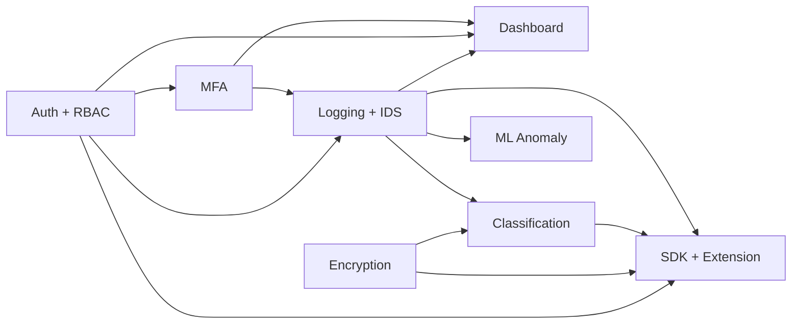

# SentinelKey — Security Stack Feature Reports

Detailed individual reports for each core security stack feature. Companion to the roadmap ([`SECURITY-STACK-PHASES.md`](../SECURITY-STACK-PHASES.md)), context ([`CONTEXT.md`](../CONTEXT.md)), and progress log ([`../progress.md`](../progress.md)).

**Core principle:** Security-critical logic is hand-built in this repository. External APIs are allowed only for peripheral delivery (email/SMS, optional KMS, charting libraries).

---

## Feature index

| ID | Feature | Phase | Report |
|---|---|---|---|
| SK-01 | Authentication & RBAC | 1 | [01-auth-rbac.md](./01-auth-rbac.md) |
| SK-02 | Multi-Factor Authentication (TOTP) | 2 | [02-mfa.md](./02-mfa.md) |
| SK-03 | Security Logging & Rules-Based IDS | 3 | [03-logging-ids.md](./03-logging-ids.md) |
| SK-04 | Security Operations Dashboard | 4 | [04-dashboard.md](./04-dashboard.md) |
| SK-05 | Encryption at Rest & File Pipeline | 5 | [05-encryption.md](./05-encryption.md) |
| SK-06 | ML Anomaly Detection | 6 | [06-ml-anomaly-detection.md](./06-ml-anomaly-detection.md) |
| SK-07 | Compliance / Classification Engine | 7 | [07-classification.md](./07-classification.md) |
| SK-08 | SDK & Browser Extension | 8 | [08-sdk-browser-extension.md](./08-sdk-browser-extension.md) |

---

## How features connect

---

## Report template (each file)

Every report includes:

1. Metadata table (ID, phase, status, locations, core vs peripheral)
2. Purpose & problem statement
3. Architecture / data flows
4. API or UI surface
5. Security controls & integrations
6. Tests & acceptance criteria
7. Known limitations

---

## Related design docs

- Encryption design gate: [`apps/api/docs/encryption-design.md`](../../apps/api/docs/encryption-design.md)
- Extension load + store checklist: [`extension/README.md`](../../extension/README.md), [`extension/SUBMISSION_CHECKLIST.md`](../../extension/SUBMISSION_CHECKLIST.md)
- SDK changelog: [`packages/security-stack-sdk/CHANGELOG.md`](../../packages/security-stack-sdk/CHANGELOG.md)

*Generated for the SentinelKey monorepo — all eight security stack features marked complete in `progress.md`.*
