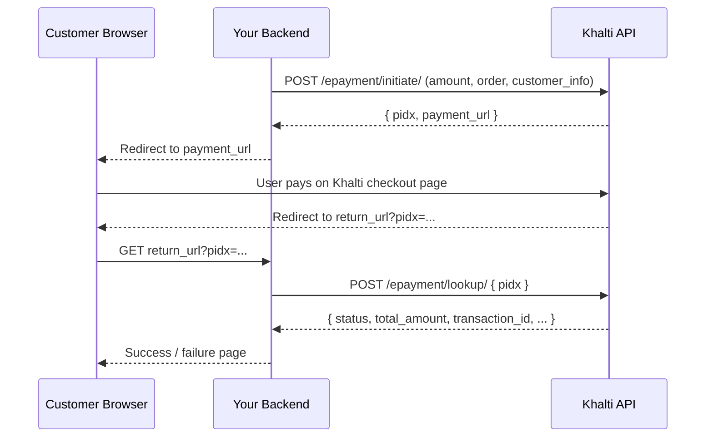

# Khalti Payment Gateway Integration Guide

> Language-agnostic reference for integrating **Khalti ePayment v2**.
> Extracted from the `backend/api` folder of this project.
> Everything below is plain HTTP/JSON — usable from any language or framework.

---

## 1. Overview

| Item | Value |
|------|-------|
| Provider | **Khalti** (Nepal digital wallet) |
| API | Khalti ePayment API **v2** |
| Protocol | REST over HTTPS, JSON body |
| Auth | `Authorization` header with secret key |
| Amount unit | **Paisa** (1 NPR = 100 paisa) |
| Verification model | **Redirect + server-side lookup** (no signed webhook used in this project) |

### Payment flow at a glance

1. Your backend sends `POST /epayment/initiate/` to Khalti.
2. Khalti returns a `payment_url` (hosted checkout page).
3. You redirect the customer's browser to `payment_url`.
4. Customer pays on Khalti's page.
5. Khalti redirects the browser back to your `return_url`, appending **`pidx`** as a query string.
6. Your backend calls `POST /epayment/lookup/` with `pidx` to get the true payment status.
7. If `status == "Completed"`, fulfill the order (activate premium, grant access, etc.).



---

## 2. Environments & Base URLs

| Environment | Base URL | Secret key prefix |
|-------------|----------|-------------------|
| Sandbox / Test | `https://dev.khalti.com/api/v2/` | `test_secret_key_...` |
| Production / Live | `https://a.khalti.com/api/v2/` | `live_secret_key_...` |

> Both environments use the **same** endpoint paths; only the base URL and key change.

### Full endpoint URLs

| Endpoint | Method | Sandbox | Production |
|----------|--------|---------|------------|
| Initiate payment | `POST` | `https://dev.khalti.com/api/v2/epayment/initiate/` | `https://a.khalti.com/api/v2/epayment/initiate/` |
| Lookup / verify | `POST` | `https://dev.khalti.com/api/v2/epayment/lookup/` | `https://a.khalti.com/api/v2/epayment/lookup/` |

---

## 3. Authentication

Every request must include an `Authorization` header containing your **secret key**:

```
Authorization: Key <SECRET_KEY>
```

- The word `Key` is used as-is (case-insensitive in practice, but the docs use `Key`).
- Example: `Authorization: Key live_secret_key_...`

> ⚠️ **Security note** — this project hardcodes secrets in PHP source files.
> Move them to environment variables / a secret manager. The exact key values found
> in this codebase are listed in §7; treat them as **compromised** and rotate them
> in your Khalti merchant dashboard before any real deployment.

---

## 4. Endpoints

### 4.1 Initiate Payment

`POST {base}/epayment/initiate/`

Starts a payment and returns a hosted checkout URL.

#### Request headers

| Header | Value |
|--------|-------|
| `Authorization` | `Key <SECRET_KEY>` |
| `Content-Type` | `application/json` |

#### Request body (JSON)

| Field | Type | Required | Description |
|-------|------|----------|-------------|
| `return_url` | string | ✅ | Your URL that Khalti redirects to after payment (gets `pidx` appended). |
| `website_url` | string | ✅ | Your website/app URL (shown to the customer). |
| `amount` | integer | ✅ | Amount in **paisa** (e.g. Rs 299 → `29900`). |
| `purchase_order_id` | string | ✅ | Unique order reference you generate (max 255 chars). |
| `purchase_order_name` | string | ✅ | Human-readable order name (e.g. "Premium Account"). |
| `customer_info` | object | ✅ | Customer details (see below). |
| `customer_info.name` | string | ✅ | Customer full name. |
| `customer_info.email` | string | ✅ | Customer email. |
| `customer_info.phone` | string | ⚠️ | Customer phone. Required in production/live. |

Example body:

```json
{
  "return_url": "https://yourapp.com/payment/success",
  "website_url": "https://yourapp.com",
  "amount": 29900,
  "purchase_order_id": "order_123456",
  "purchase_order_name": "Premium Account",
  "customer_info": {
    "name": "John Doe",
    "email": "john@example.com",
    "phone": "9800000000"
  }
}
```

#### Response (200)

```json
{
  "pidx": "HT6o6PEZRWFJ5ygavzHWd5",
  "payment_url": "https://test-pay.khalti.com/?pidx=HT6o6PEZRWFJ5ygavzHWd5",
  "expires_at": "2026-09-27T10:45:00.000000Z",
  "expires_in": 1800
}
```

| Field | Type | Description |
|-------|------|-------------|
| `pidx` | string | Payment ID — **store this**, you need it for lookup. |
| `payment_url` | string | Redirect the customer here to pay. |
| `expires_at` | string | ISO timestamp when the payment link expires. |
| `expires_in` | integer | Seconds until expiry (usually 1800 = 30 min). |

#### Error response

```json
{ "error": "..." }
```

or a non-200 HTTP status with a `detail` field describing the problem.

---

### 4.2 Lookup / Verify Payment

`POST {base}/epayment/lookup/`

Returns the definitive status of a payment. **Never trust the browser redirect alone — always verify with this call.**

#### Request headers

| Header | Value |
|--------|-------|
| `Authorization` | `Key <SECRET_KEY>` |
| `Content-Type` | `application/json` |

#### Request body (JSON)

```json
{ "pidx": "HT6o6PEZRWFJ5ygavzHWd5" }
```

| Field | Type | Required | Description |
|-------|------|----------|-------------|
| `pidx` | string | ✅ | The payment ID from the initiate response or `return_url`. |

#### Response (200)

```json
{
  "pidx": "HT6o6PEZRWFJ5ygavzHWd5",
  "total_amount": 29900,
  "status": "Completed",
  "transaction_id": "txn_123456",
  "fee": 0,
  "refunded": false,
  "customer_info": {
    "name": "John Doe",
    "email": "john@example.com",
    "phone": "9800000000"
  }
}
```

Key fields:

| Field | Type | Description |
|-------|------|-------------|
| `pidx` | string | Payment ID echoed back. |
| `total_amount` | integer | Amount paid, in paisa. |
| `status` | string | Payment status — see §5. |
| `transaction_id` | string | Khalti's transaction identifier. |
| `fee` | integer | Khalti's service fee in paisa (if any). |
| `refunded` | boolean | Whether the payment was refunded. |
| `customer_info` | object | Customer details as submitted. |

---

## 5. Payment Status Values

Treat only **`Completed`** as success. Everything else = do not fulfill the order.

| Status | Meaning | Action |
|--------|---------|--------|
| `Completed` | Payment succeeded | ✅ Fulfill the order |
| `Pending` | Not yet confirmed | ⏳ Wait / re-check |
| `Initiated` | Checkout opened, not paid | ❌ Do not fulfill |
| `Expired` | Payment link timed out | ❌ Do not fulfill |
| `User canceled` | Customer abandoned | ❌ Do not fulfill |
| `Refunded` | Fully refunded | ❌ Revoke access if already granted |
| `Partially Refunded` | Partially refunded | ⚠️ Handle manually |

---

## 6. Amount Convention (Important)

Khalti v2 expects amounts in **paisa** (the smallest unit), not rupees:

```
amount_in_paisa = amount_in_rupees × 100
```

| Rupees | Paisa |
|--------|-------|
| Rs 50 | `5000` |
| Rs 299 | `29900` |

This project uses:
- Premium signup: Rs 299 → `29900`
- Premium upgrade (one variant): Rs 50 → `5000`

---

## 7. Credentials & Configuration Found in This Codebase

The following values were found hardcoded across `backend/api/*.php`.
**They are listed for completeness only — do not reuse them verbatim in a new project.**

| Item | Value found | Where used |
|------|-------------|------------|
| Sandbox base URL | `https://dev.khalti.com/api/v2/` | `initiatePayment.php`, `payment.php`, `initiateUpgradePremium.php`, `paymentSuccess.php`, `upgradeSuccess.php` |
| Production base URL | `https://a.khalti.com/api/v2/` | `payment-request.php`, `payment-response.php`, `lookup.php` |
| Live secret key (prefix `Key`/`key`) | `live_secret_key_68791341fdd94846a146f0457ff7b455` | most files |
| Sandbox secret key (no prefix) | `14509adc517743ce8f8eb6bd83bf7082` | `payment.php` |

**Recommendations:**
- Use `test_secret_key_...` with the `dev.khalti.com` base in development.
- Use `live_secret_key_...` with the `a.khalti.com` base in production.
- Store keys in environment variables, never in source control.
- Rotate the keys above in the Khalti merchant dashboard — they are now exposed.

---

## 8. Minimal End-to-End Example (cURL)

### Step 1 — Initiate

```bash
curl -X POST "https://dev.khalti.com/api/v2/epayment/initiate/" \
  -H "Authorization: Key test_secret_key_YOUR_KEY_HERE" \
  -H "Content-Type: application/json" \
  -d '{
    "return_url": "https://yourapp.com/payment/success",
    "website_url": "https://yourapp.com",
    "amount": 29900,
    "purchase_order_id": "order_123456",
    "purchase_order_name": "Premium Account",
    "customer_info": {
      "name": "John Doe",
      "email": "john@example.com",
      "phone": "9800000000"
    }
  }'
```

**Response:** capture `pidx` and redirect customer to `payment_url`.

### Step 2 — Verify after redirect

```bash
curl -X POST "https://dev.khalti.com/api/v2/epayment/lookup/" \
  -H "Authorization: Key test_secret_key_YOUR_KEY_HERE" \
  -H "Content-Type: application/json" \
  -d '{ "pidx": "HT6o6PEZRWFJ5ygavzHWd5" }'
```

**Response:** if `status == "Completed"`, fulfill the order using `total_amount` and `transaction_id`.

---

## 9. Implementation Notes & Gotchas (from this codebase)

- **`pidx` arrives via query string** on the `return_url` (e.g. `.../success?pidx=...`). Read it from `GET`, then call lookup.
- **Always re-verify server-side.** The redirect alone tells you nothing about whether payment actually succeeded.
- **Store `pidx` before redirecting** the customer, so you can reconcile if the user abandons and returns later.
- **Idempotency:** guard your "fulfill order" step so a repeated `return_url` hit (refresh) doesn't double-grant access. Check whether `pidx` was already processed before applying the upgrade.
- **`purchase_order_id` must be unique** per transaction — use a timestamp/random suffix.
- **Phone is required in production**; the dev environment tolerates omitting it, but live payments will fail without it.
- **The `Authorization` prefix case** is inconsistent across the files (`Key` vs `key`); both are accepted, but `Key` is canonical.
- **CORS:** if the initiate endpoint is called directly from a browser SPA, the backend must return appropriate `Access-Control-Allow-*` headers and handle `OPTIONS` preflight (this project's `config.php` does exactly that).
- **Customer data flow:** in this project, signup data is staged in a session/database *before* initiating payment, then consumed on the `return_url` — a clean pattern for "collect data → pay → create account on success".

---

## 10. Quick Reference Card

| Question | Answer |
|----------|--------|
| Gateway | Khalti (Nepal) |
| API version | ePayment v2 |
| Sandbox base URL | `https://dev.khalti.com/api/v2/` |
| Production base URL | `https://a.khalti.com/api/v2/` |
| Initiate endpoint | `POST /epayment/initiate/` |
| Verify endpoint | `POST /epayment/lookup/` |
| Auth header | `Authorization: Key <secret_key>` |
| Amount unit | Paisa (rupees × 100) |
| Success status | `Completed` |
| Payment page | Hosted by Khalti (`payment_url`) |
| Payment ID | `pidx` |
