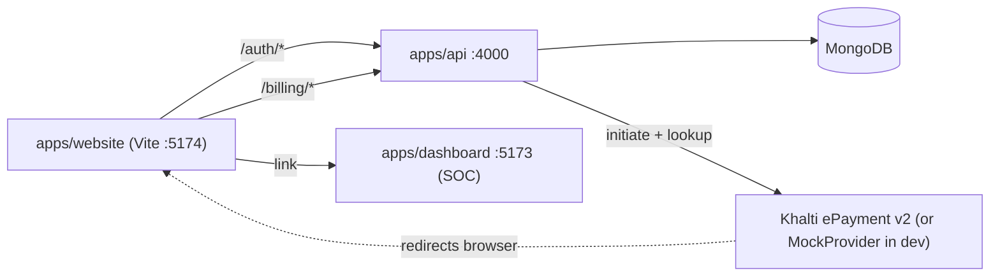
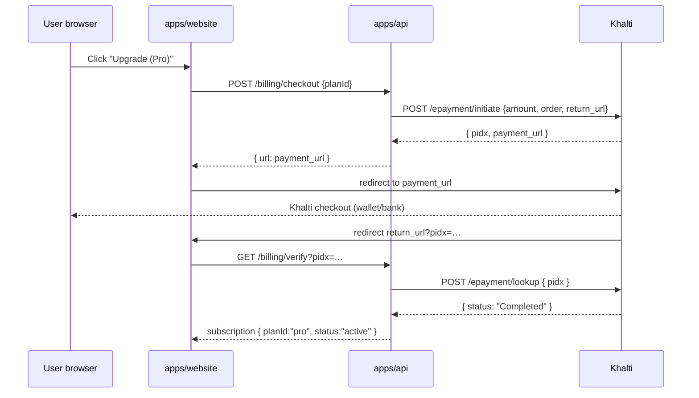

# SentinelKey Website & Billing — Implementation Plan

> Status: **PLAN (awaiting approval before code)**
> Owner: coding agent
> Date: 2026-09-27
> Payment gateway: **Khalti** (Nepal) · Currency: **NPR**

## 1. Goal

A public-facing **SentinelKey website** that:

1. Shows a **landing page** (hero, features, pricing) — no auth required.
2. Lets visitors **sign up / log in** using the existing auth API.
3. After auth, leads to a **hub page** styled like Docker Hub: a left **sidebar** + a main panel of **app-service cards**.
4. Adds a **billing / payment** service with a subscription structure, paid via **Khalti**.

The website is a _marketing + hub + billing_ layer. It does **not** replace `apps/dashboard` (the Security Operations Console) — it links into it.

## 2. Key decisions

| Decision                | Choice                                                                                   | Rationale                                                                                                                   |
| ----------------------- | ---------------------------------------------------------------------------------------- | --------------------------------------------------------------------------------------------------------------------------- |
| Where the website lives | New app `apps/website` (Vite + React 18 + TS)                                            | Keeps marketing/hub/billing separate from the SOC console; matches monorepo pattern                                         |
| Routing                 | `react-router-dom` v6                                                                    | Landing/auth/hub/billing are real URLs, not tab state                                                                       |
| Auth                    | **Reuse** existing `/auth/*` endpoints                                                   | No new auth logic — login/register/refresh already exist + are tested                                                       |
| Payment gateway         | **Khalti ePayment v2** (`a.khalti.com/api/v2`), with a **mock provider** fallback in dev | Khalti is peripheral delivery (allowed). Mock keeps dev zero-dependency (no keys/Docker). Currency is NPR; amounts in paisa |
| Plans                   | Static plan definitions in code + subscription records in DB                             | Plans gate features in code; rarely change. Subscription state (per-user) lives in Mongo                                    |
| Shared types            | Add billing types to `@sentinelkey/shared-types`                                         | Consistency with existing auth/alert types                                                                                  |
| Design system           | **Docker-style light theme with purple accents** (§4)                                    | Mirrors the official docker.com layout & structure; Docker blue → purple. No new UI framework                               |
| Design tooling          | Spec authored here → passed to **Stitch AI** for visual design first                     | Design-first: lock the look, then implement                                                                                 |

## 3. Architecture



- `apps/website` dev port **5174** (5173 is taken by the dashboard).
- Vite proxy for `/auth`, `/billing`, `/health` → `http://localhost:4000`.
- The hub's service cards **link** to the SOC dashboard (new tab) — no embedding needed.

### Payment flow (Khalti)

1. User clicks **Upgrade** on a plan → `POST /billing/checkout`.
2. Server calls Khalti **initiate** → gets `pidx` + `payment_url`.
3. Browser is redirected to `payment_url` (Khalti hosted checkout).
4. On completion Khalti redirects back to `return_url` (the Billing page) with `pidx`.
5. Frontend calls `GET /billing/verify?pidx=…` → server calls Khalti **lookup**, reads `status`, and finalizes the subscription when `Completed`.



## 4. Design System & UI Specification (Exact Reference Implementation)

> This section reflects the **exact structure and colors** from the provided reference images:
>
> - **Image 1 (Landing Page `/`):** Docker-style hybrid theme — pitch-black hero with alphanumeric particle scatter, luminous spotlight cards, light product/terminal comparison and 2×2 runtime showcase with 3D wireframe visuals, enterprise stats, product preview, and deep dark footer.
> - **Image 2 (User Hub `/app`):** Sleek dark developer console — obsidian/plum background (`#0D0B18`), purple accent branding, gradient welcome banner, full 10-item security/workspace sidebar, exact 6 SentinelKey product cards, 4 resources cards, and live hardware attestation daemon dock.

### 4.1 Palette & Color Tokens

#### Landing Page Theme (Image 1)

| Token                        | Value                     | Description / Usage                                  |
| ---------------------------- | ------------------------- | ---------------------------------------------------- |
| `--landing-hero-bg`          | `#0A0D14`                 | Pitch black/navy hero background                     |
| `--landing-hero-cta`         | `#1D63ED`                 | Docker vibrant blue primary button (hover `#174FCE`) |
| `--landing-spotlight-bg`     | `#FFFFFF`                 | Luminous white cards with gradient glow borders      |
| `--landing-spotlight-border` | `rgba(37, 99, 235, 0.35)` | Blue glowing border on spotlight cards               |
| `--landing-body-bg`          | `#FFFFFF`                 | Light background for body sections                   |
| `--landing-section-alt`      | `#F8F9FC`                 | Off-white section background                         |
| `--landing-text-head`        | `#0F172A`                 | Deep dark slate headings                             |
| `--landing-text-body`        | `#475569`                 | Neutral slate body text                              |
| `--landing-terminal-bg`      | `#111625`                 | Dark macOS terminal window background                |
| `--landing-footer-bg`        | `#080C14`                 | Pitch black/navy enterprise footer                   |

#### Hub Console Theme (Image 2)

| Token                   | Value                                                            | Description / Usage                                     |
| ----------------------- | ---------------------------------------------------------------- | ------------------------------------------------------- |
| `--hub-bg-app`          | `#0D0B18`                                                        | Deep obsidian/plum console background                   |
| `--hub-sidebar-bg`      | `#131021`                                                        | Dark violet sidebar background                          |
| `--hub-card-bg`         | `#171328`                                                        | Dark card surface                                       |
| `--hub-card-border`     | `#261E3D`                                                        | 1px border for product and resource cards               |
| `--hub-card-hover`      | `#1E1834`                                                        | Card surface on hover                                   |
| `--hub-purple-primary`  | `#6B4DE6`                                                        | SentinelKey primary purple (buttons, links, active bar) |
| `--hub-purple-hover`    | `#7C3AED`                                                        | Bright purple hover / button active                     |
| `--hub-purple-light`    | `#A78BFA`                                                        | Lavender accent text and tags                           |
| `--hub-purple-gradient` | `linear-gradient(135deg, #4C1D95 0%, #311368 60%, #1E0E45 100%)` | Welcome banner background                               |
| `--hub-status-emerald`  | `#10B981`                                                        | Green active daemon indicator and scout badge           |
| `--hub-text-primary`    | `#F8FAFC`                                                        | Bright white text for headers                           |
| `--hub-text-secondary`  | `#94A3B8`                                                        | Muted slate text for descriptions                       |
| `--hub-text-muted`      | `#64748B`                                                        | Category subtitles (e.g. "INNOVATE WITH")               |
| `--hub-sidebar-active`  | `rgba(107, 77, 230, 0.22)`                                       | Active sidebar item fill                                |

---

### 4.2 Page Structure Specs (Exact match to images)

#### (a) Landing Page `/` (Image 1 Structure)

1. **Top Navbar:**
   - Dark background (`#0A0D14`), bottom hairline border.
   - Left: Logo icon + Wordmark + Nav dropdown links: _Products_, _Support_, _Pricing_, _Blog_, _Docs_.
   - Right: Search trigger icon `(Q)`, ghost link _Sign In_, solid CTA _Get started_.
2. **Hero:**
   - Dark `#0A0D14` background with scattered floating monospace letters (`E`, `R`, `X`, `D`, `K`).
   - Title: "Trust SentinelKey for the Agents You Don't"
   - Subtitle: "SentinelKey securely contains autonomous agents and critical workloads so you can confidently build, ship, and run on trust."
   - Dual CTAs: Blue primary `Get started` + white outline `Learn more`.
3. **3 Spotlight Cards:**
   - Card 1: **Sentinel Sandboxes** — MicroVM isolation for every agent session, rootfs, virtual network, and filesystem shield at the runtime.
   - Card 2: **Sentinel AI Governance** — One console for sanction access, privacy, baseline guardrails, and real-time intervention.
   - Card 3: **Sentinel Hardened Images** — Minimal, signed, continuously patched images and FIPS-ready runtimes.
4. **Partner / Trust Logo Strip:**
   - Grayscale partner logo band on white.
5. **"Invisible to developers. Total control for security." (Dual Comparison):**
   - Left macOS terminal: _Developer view: Your laptop. One command._ (`sentinel run...`).
   - Right dark console card: _Governance console: Your console. Fourteen checks._ (live check badges, 14/14 checks pass).
6. **"The runtime under every agent" (2×2 Runtime Grid):**
   - Card 1: _Isolation you can trust_ (with terminal snapshot).
   - Card 2: _Start local. Scale anywhere._ (with execution speed metrics `Ready in 100ms`).
   - Card 3: _Nothing to fix and replace_ (with 3D isometric blue wireframe cube).
   - Card 4: _No lock-in. Ever._ (with 3D wireframe sphere).
7. **Value Pillars (3 Columns):**
   - _Lower cost through leaked safe-entry_
   - _Ship faster. Without the breach._
   - _Compliant by default._
8. **Enterprise Numbers / Stats:**
   - `91%` Fortune 100 benchmark, `20B+` telemetry events, `20M+` secured agent tasks.
9. **SentinelKey Desktop Showcase:**
   - "How modern applications get built. Containers and the full-day loop in one place."
   - Button: `Download SentinelKey Desktop`.
   - Full desktop console UI preview.
10. **"Build better, together":**
    - 4 pills: _SentinelKey Desktop_, _Sentinel AI Governance_, _Sentinel Hardened Baselines_, _Sentinel Scout_.
11. **Dark Enterprise Footer (`#080C14`):**
    - Columns: _Products_, _Features_, _Developers_, _Pricing_, _Company_, _Languages_.
    - Copyright © 2026 SentinelKey Inc. + Terms, Privacy, Legal.

---

#### (b) User Hub Page `/app` (Image 2 Structure)

1. **Top Header Bar:**
   - SentinelKey shield/keyhole logo + "SentinelKey" wordmark + "Sentinel Key" active workspace pill.
   - Right: Help icon `(?)`, Notification bell with unread badge, Theme toggle (moon/sun), User avatar.
2. **Left Sidebar Navigation:**
   - **Profile Block:** Avatar `[A]`, username `alexchen`, subtitle `Personal Workspace`, dropdown chevron.
   - **WORKSPACE Section:**
     - `Home` (Active: purple tint fill + purple left indicator bar).
     - `Build & Enclave`
   - **ACCOUNT & SECURITY Section:**
     - `Account Information`
     - `Email & Identity`
     - `Password`
     - `2FA & Passkeys` (links to MFA flow)
     - `Personal Access Tokens`
     - `Connected Clusters`
     - `Convert / Organization`
     - `Privacy & Audit`
     - `Deactivate` (red/orange warning icon)
   - **Sidebar Bottom:**
     - `Billing & Subscription` (card/wallet icon, links to `/app/billing`)
3. **Cosmic Purple Welcome Banner:**
   - Radiant purple gradient background with cosmic star scatter.
   - Dismiss `×` button.
   - Title: "Welcome to SentinelKey Home, alexchen"
   - Body: "Access and manage your SentinelKey Enclave, Build Shield, Intrusion Detection, and Vault products, and get access to resources for learning, support, and account settings, including billing management."
   - Buttons: `Get started with SentinelKey guidance` (solid white) + `Learn about Zero-Trust concepts` (translucent purple).
4. **"SentinelKey products" 3×2 Grid:**
   - Card 1: `sentinel:desktop` | INNOVATE WITH | **SentinelKey Desktop** | Command center for local cryptographic enclave execution. | "Go to download" link + "Launch SentinelKey Desktop" solid purple button.
   - Card 2: `buildshield` | BUILD WITH | **Build Shield Cloud** | Accelerate confidential build times with remote attestation clusters. | "Go to Build Shield →".
   - Card 3: `sentinel:scout` | SECURE WITH | **Sentinel Scout** | Real-time intrusion detection and kernel-level vulnerability telemetry. | "Go to Scout →".
   - Card 4: `sentinel:vault` | EXPLORE WITH | **Sentinel Hub & Vault** | Discover, distribute, store, and attest container images and secrets. | "Go to Hub →".
   - Card 5: `TestEnclaves` | TEST WITH | **TestEnclaves Cloud** | Scale out automated zero-trust security integration testing. | "Go to TestEnclaves Cloud →".
   - Card 6: `HardenedBaselines` | SECURE WITH | **Sentinel Hardened Baselines** | Near-zero CVEs, 92% smaller images, FIPS 140-3 compliance SLA. | "View Catalog →".
5. **"Resources" 4 Cards Grid:**
   - Card 1: GROW WITH | **SentinelKey Learning Paths** | "Start learning ↗"
   - Card 2: LEARN WITH | **Docs** | "Go to Docs ↗"
   - Card 3: GET HELP WITH | **Support** | "Open a ticket ↗"
   - Card 4: CONTRIBUTE WITH | **Forums** | "Go to Forums ↗"
6. **Hardware Attestation Daemon Status Dock:**
   - Docked dark pill at the bottom:
   - Green indicator `● Hardware Attestation Daemon: OK (Enclave active) | Cluster: us-east-sgx-04`
   - Terminal quick action: `sentinel enclave status` + copy icon.
7. **Console Footer:**
   - "SentinelKey © 2026 SentinelKey Inc. All rights reserved."
   - Terms · Subscription Agreement · Privacy · Legal · System Status · Social links.

#### (c) Billing page `/app/billing` — protected

- Header "Billing & Subscription" + current plan summary card (plan name, status pill, renewal date, **Manage** button).
- Plan picker: same 3 cards as landing pricing, current plan marked "Current", others show **Upgrade** (→ Khalti) or **Downgrade**.
- Invoice history: table (mono amounts in NPR) — columns: Invoice #, Date, Amount, Status, (Download when available). Empty state if none.

#### (e) Settings page `/app/settings` — protected

- Profile card: email (read-only), avatar, member-since.
- Security card: MFA status + button linking to SOC MFA flow (`/auth/mfa/setup`).
- Account card: sign out everywhere, delete request placeholder.

### 4.8 Component specs

- **Button**
  - Variants: `primary` (solid `--color-purple`, white text; hover `--color-purple-deep`), `secondary` (outline `--border-active`, `--text-primary`), `ghost` (no border, `--text-secondary` → `--color-purple` on hover), `danger` (rose).
  - Sizes: sm (h 32, pad 8/14), md (h 40, pad 12/20), lg (h 48, pad 16/28, 16px font).
  - Radius 8; focus ring `2px` purple outline.
- **Input** — h 40, white bg, 1px `--border-subtle`, radius 6; focus → border `--color-purple` + `0 0 0 3px rgba(107,77,230,.15)`. Label above (14px, `--text-secondary`).
- **Card** — white bg, radius 12, 1px `--border-subtle`, padding 24; hover `translateY(-4px)`, `--bg-card-hover`, border `--border-active`, `shadow-lg`.
- **Sidebar nav item** — h 40, pad 10/14, radius 8, icon 18px, label 14px/500; active = purple text + `--bg-tint`.
- **Status pill** — mono 12px, uppercase; `active`/`Completed`=emerald, `Pending`=amber, `canceled`=muted, `failed`/`Expired`=rose; 10% tinted bg + matching border.
- **Badge** ("POPULAR", plan) — mono 12px uppercase pill, purple tint bg + purple border.
- **Table** — header row `--text-muted` 12px uppercase; rows 14px with hairline `--border-subtle`; hover row `--bg-section`.
- **Code block** — `--bg-tint` (or dark plum) bg, mono 13px, copy button top-right, radius 12.

### 4.9 States

- **Loading:** skeleton placeholders (card-shaped shimmer) or centered spinner (`Loader2` rotating).
- **Empty:** icon + one-line message + optional CTA, centered in the panel.
- **Error:** rose-tinted panel with `AlertTriangle` + message.
- **Success:** emerald toast "Subscription updated" bottom-right.

### 4.10 Responsive breakpoints

| Breakpoint | Behavior                                                 |
| ---------- | -------------------------------------------------------- |
| ≥ 1200px   | 4-column service grid; hero two-column                   |
| 900–1199px | 3-column grid                                            |
| 640–899px  | 2-column grid; hero stacks; sidebar collapses to top bar |
| < 640px    | 1-column; nav becomes hamburger; pricing stacks          |

### 4.11 Accessibility

- WCAG AA contrast on all text (deep-plum on white passes; purple `#6B4DE6` on white is 4.6:1 — use `--color-purple-deep` for body links if needed).
- Visible `:focus-visible` ring (2px purple) on all interactive elements.
- Form inputs have programmatic labels; errors announced via `role="alert"`.
- Keyboard: full tab order, Enter/Space on buttons and nav, Escape closes modals.

## 5. Frontend — `apps/website`

```
apps/website/
├── package.json                 # deps: react, react-dom, react-router-dom, lucide-react, @sentinelkey/shared-types
├── tsconfig.json
├── vite.config.ts               # port 5174, proxy /auth /billing /health → :4000
├── index.html
└── src/
    ├── main.tsx                 # BrowserRouter + AuthProvider
    ├── App.tsx                  # route table + protected routes
    ├── index.css                # Docker-style purple theme tokens (§4)
    ├── context/AuthContext.tsx  # token + refresh handling (port of dashboard AuthContext)
    ├── services/api.ts          # fetch wrapper (port of dashboard services/api.ts)
    ├── pages/
    │   ├── LandingPage.tsx      # hero, features, pricing, footer
    │   ├── LoginPage.tsx        # /login
    │   ├── SignupPage.tsx       # /signup
    │   ├── HubPage.tsx          # sidebar + service cards (protected)
    │   ├── BillingPage.tsx      # plans + current subscription + invoices (protected)
    │   └── SettingsPage.tsx     # profile + MFA links (protected)
    └── components/
        ├── landing/Navbar.tsx
        ├── landing/Hero.tsx
        ├── landing/Features.tsx
        ├── landing/Pricing.tsx
        └── landing/Footer.tsx
        ├── hub/Sidebar.tsx      # nav: Home, Services, Billing, Settings, Sign out
        ├── hub/ServiceCard.tsx  # icon, title, blurb, "Open" button
        └── billing/PlanCard.tsx, SubscriptionStatus.tsx, InvoiceList.tsx
```

### Routes

| Path            | Access    | Content                               |
| --------------- | --------- | ------------------------------------- |
| `/`             | public    | Landing (hero, features, pricing)     |
| `/login`        | public    | Login form → POST `/auth/login`       |
| `/signup`       | public    | Signup form → POST `/auth/register`   |
| `/app`          | protected | Hub: sidebar + service cards          |
| `/app/billing`  | protected | Plans, current subscription, invoices |
| `/app/settings` | protected | Profile + link to enable MFA          |

### Service cards (hub main panel)

Docker-Hub-style grid of the stack's services:

| Card                                    | Action                                     |
| --------------------------------------- | ------------------------------------------ |
| Security Operations Console             | Open `apps/dashboard` (new tab)            |
| ML Anomaly Detection                    | Info card + status (links to `ml-service`) |
| Browser Extension                       | Download / install instructions            |
| SDK (`@sentinelkey/security-stack-sdk`) | Docs / npm info                            |
| Billing & Subscription                  | Navigate to `/app/billing`                 |
| Account Settings                        | Navigate to `/app/settings`                |

## 6. Backend — billing module in `apps/api`

```
apps/api/src/
├── config/
│   ├── env.ts                  # + KHALTI_SECRET_KEY, KHALTI_BASE_URL, WEBSITE_URL
│   └── plans.ts                # static plan catalog (id, name, priceNpr, currency, features)
├── models/
│   ├── subscription.model.ts   # userId, planId, status, khaltiPidx, currentPeriodEnd, cancelAtPeriodEnd
│   └── invoice.model.ts        # userId, khaltiTransactionId, amountPaisa, currency, status, paidAt
├── services/
│   ├── payment-provider.ts     # Provider interface + KhaltiProvider + MockProvider (auto-select)
│   ├── billing.service.ts      # getPlans, getSubscription, checkout, verifyPayment, cancel, listInvoices
│   └── feature-gate.ts         # (deferred — see §10)
├── controllers/billing.controller.ts
├── routes/billing.routes.ts
└── index.ts                    # mount /billing
```

### Endpoints

| Method | Path                     | Auth   | Description                                               |
| ------ | ------------------------ | ------ | --------------------------------------------------------- |
| GET    | `/billing/plans`         | none   | Plan catalog                                              |
| GET    | `/billing/subscription`  | Bearer | Current user's subscription (auto-creates "free" default) |
| POST   | `/billing/checkout`      | Bearer | Body `{ planId }` → Khalti initiate (or mock) → `{ url }` |
| GET    | `/billing/verify?pidx=…` | Bearer | Khalti lookup → finalize subscription when `Completed`    |
| POST   | `/billing/cancel`        | Bearer | Cancel subscription (Khalti or mock)                      |
| GET    | `/billing/invoices`      | Bearer | Invoice history                                           |

> Note: Khalti ePayment v2 has **no server webhook by default** — status is resolved via the
> **lookup** call on `return_url` redirect (and a short polling retry for `Pending`). If a webhook is
> later configured in the Khalti merchant dashboard, it can be added behind the same provider interface.

### Pricing structure (NPR)

| Plan           | Price        | Highlights                                                   |
| -------------- | ------------ | ------------------------------------------------------------ |
| **Free**       | NPR 0        | Self-hosted core, 1 user, community support                  |
| **Pro**        | NPR 2,499/mo | ML anomaly detection, field/file encryption, priority alerts |
| **Enterprise** | Custom       | SSO, dedicated support, unlimited users                      |

Prices are **display-only** in this iteration; `feature-gate.ts` is deferred (§10). Khalti amounts are
sent in **paisa** (`NPR × 100`).

### Khalti integration (ePayment v2)

- **Base URL:** `https://a.khalti.com/api/v2`
- **Auth header:** `Authorization: Key {secret_key}` (test: `test_secret_key_…`, live: `live_secret_key_…`)
- **Initiate:** `POST /epayment/initiate/`
  ```json
  {
    "return_url": "http://localhost:5174/app/billing?pidx={{pidx}}",
    "website_url": "http://localhost:5174",
    "amount": 249900,
    "purchase_order_id": "<uuid>",
    "purchase_order_name": "SentinelKey Pro — Monthly",
    "customer_info": { "name": "…", "email": "…" }
  }
  ```
  Response: `{ pidx, payment_url, expires_at, expires_in }`.
- **Lookup (verify):** `POST /epayment/lookup/` with `{ "pidx": "…" }` → `{ status, total_amount, transaction_id, … }`.
  Statuses: `Initiated`, `Pending`, `Completed`, `Expired`, `User canceled`, `Refunded`, `Partially Refunded`.
- Subscription becomes `active` only when lookup returns `Completed`.

### Payment provider abstraction

```ts
interface PaymentProvider {
  initiateCheckout(opts: {
    planId: string;
    amountPaisa: number;
    orderName: string;
    customer: { name: string; email: string };
    returnUrl: string;
  }): Promise<{ pidx: string; url: string }>;
  verifyPayment(
    pidx: string,
  ): Promise<{ status: PaymentStatus; transactionId?: string; amountPaisa?: number }>;
  cancelSubscription(subscriptionId: string): Promise<void>;
}
```

- `KhaltiProvider` — used when `KHALTI_SECRET_KEY` is set. Thin `fetch` wrapper (no heavyweight SDK needed).
- `MockProvider` — used otherwise (dev). Simulates initiate → `url` to a local mock page, and verify → `Completed`, so the whole flow works with **zero** external keys/Docker.
- Selection is one line at startup based on env; the rest of the code is provider-agnostic.

No new server dependency required for Khalti (plain `fetch`); keep the module behind the provider interface
so another gateway can be swapped in later.

## 7. Shared types (`packages/shared-types`)

Add `src/billing.ts`:

- `BillingPlanId = 'free' | 'pro' | 'enterprise'`
- `IBillingPlan` (id, name, priceNpr, currency, interval, features, highlighted?)
- `ISubscription` (planId, status, currentPeriodEnd, cancelAtPeriodEnd)
- `IInvoice` (amountPaisa, currency, status, paidAt, transactionId?)
- `ICheckoutSessionResponse` (`{ pidx: string; url: string }`)
- `PaymentStatus = 'Initiated' | 'Pending' | 'Completed' | 'Expired' | 'User canceled' | 'Refunded' | 'Partially Refunded'`

Re-export from `index.ts`.

## 8. Env additions (`apps/api/.env.example` + `env.ts`)

```
KHALTI_SECRET_KEY=            # omit → MockProvider (dev)
KHALTI_BASE_URL=https://a.khalti.com/api/v2
WEBSITE_URL=http://localhost:5174   # return_url / website_url for Khalti checkout
```

## 9. Implementation order (each step verifiable)

1. **Shared types** — `billing.ts` + barrel export → build.
2. **API billing module** — plans, models, provider (mock first), service, routes, mount → typecheck + unit tests.
3. **API tests** — `billing.service.test.ts` (mock provider): plans, default free subscription, checkout → subscription, verify (Completed/Pending/User canceled), cancel, invoices.
4. **Khalti provider** — implement initiate + lookup with `fetch` (guarded by env; mock path unaffected) → typecheck.
5. **Website scaffold** — `apps/website` Vite app, router, theme tokens, landing page (static first) matching §4.
6. **Auth pages** — login/signup wired to `/auth/*`, token storage + refresh (port of dashboard).
7. **Hub page** — protected route, sidebar, service cards.
8. **Billing UI** — plans grid, checkout button → Khalti/mock URL, verify-on-return, subscription status, invoice list.
9. **Settings page** — profile + MFA link (reuse `/auth/me`, `/auth/mfa/*`).
10. **Wire-up & docs** — mount in `pnpm-workspace` (already matches `apps/*`), root README note, `progress.md` update.

## 10. Explicitly deferred (YAGNI)

- **Feature gating** by plan (`feature-gate.ts`) — not requested; plans are recorded but do not yet restrict endpoints. Add only when a paid plan must unlock a capability.
- **Khalti merchant webhook** — epayment v2 resolves via lookup; add only if the merchant dashboard enables server notifications.
- **Khalti refund / partial-refund flows** — out of scope; cancel stops future renewal.
- **Team/org billing, seats, usage metering** — out of scope.

## 11. Verification

- `pnpm --filter @sentinelkey/api typecheck` and `pnpm --filter @sentinelkey/api test`.
- `pnpm --filter @sentinelkey/website typecheck`, `build`, `lint`.
- Manual: start API + website; sign up → land on hub; open a service card; start Pro checkout (mock in dev) → Khalti flow → `verify` flips subscription to `active`; invoice appears.
- Khalti path verified with **test keys** only; lookup/status mapping covered by unit tests against mocked provider responses.

## 12. Open questions (defaults chosen, confirm to proceed)

1. **Payment gateway** — Khalti ePayment v2 with dev mock fallback (as requested). Confirm test keys will be added via env, never committed.
2. **Site vs. dashboard relationship** — website is a new app that _links_ to the SOC dashboard (recommended). Alternative: fold the hub into the existing dashboard.
3. **Pricing numbers** — Free / NPR 2,499 Pro / custom Enterprise (adjust freely; they're config in one file).
4. **Design handoff** — §4 is ready to paste into Stitch AI. Confirm before I generate the visual design and start coding.
